# Secure CI Pipeline Implementation and Product Delivery
## Project Overview

This project demonstrates the implementation of a secure CI pipeline using Jenkins. The pipeline integrates security scanning, testing, quality analysis, artifact packaging, and reporting.

The pipeline was implemented using a dedicated cicd branch, as required in the project instructions. Each stage of the pipeline performs a specific task such as building the application, scanning dependencies for vulnerabilities, running tests, generating coverage reports, and packaging the application artifact.

The pipeline automates secure software delivery while providing visibility into security, quality, and testing results.

----
## Repository Link

**GitHub Repository:** [View Project on GitHub](https://github.com/rriffaha/secure-ci-pipeline)

## Repository Structure
```
secure-ci-pipeline
│
├── Jenkinsfile
├── pom.xml
├── README.md
├── .gitignore
├── src
│   ├── main
│   └── test
└── Screenshots
```
----

## Pipeline Architecture

**The CI pipeline performs the following stages:**
```
Developer Commit (cicd branch)
│
GitHub
│
Jenkins Pipeline
│
├── Checkout
├── Build
├── Dependency Scanning
│      ├── OWASP Dependency Check
│      └── Dependency Updates
├── Trivy Security Scan
├── Publish Dependency Reports
├── Code Coverage (JaCoCo)
├── Unit Tests
├── Integration Tests
└── Package Artifact
```
### Jenkins Pipeline Execution Overview

The following screenshot shows the complete execution of the pipeline in Jenkins, where all stages completed successfully.

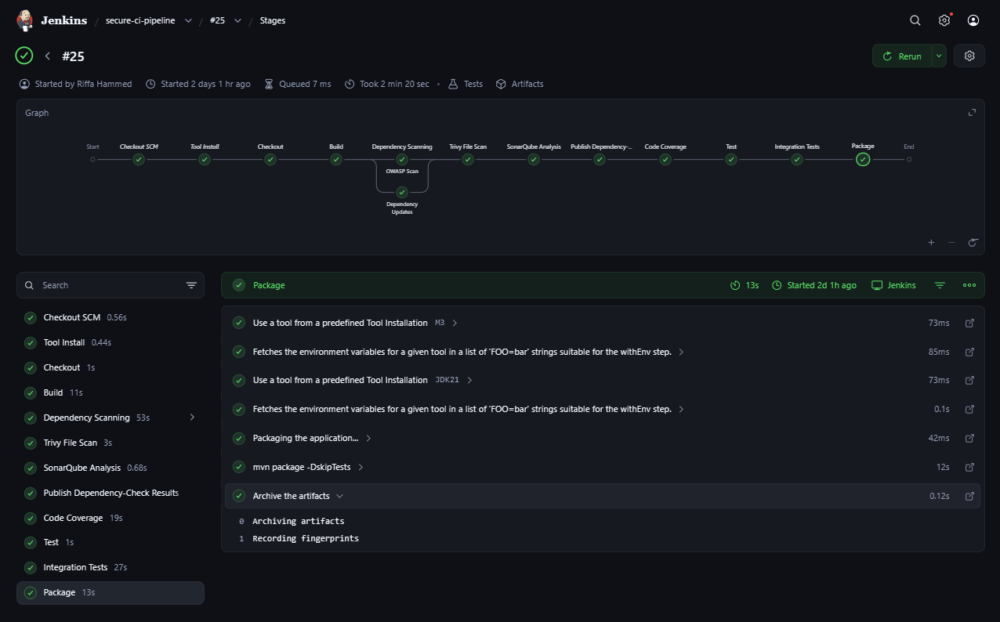

----

## Stage A — Checkout

The pipeline retrieves the source code from the GitHub repository using Jenkins Git integration.

Jenkins clones the repository and checks out the cicd branch.

**Evidence from Jenkins console log:**

Checking out Revision (refs/remotes/origin/cicd)
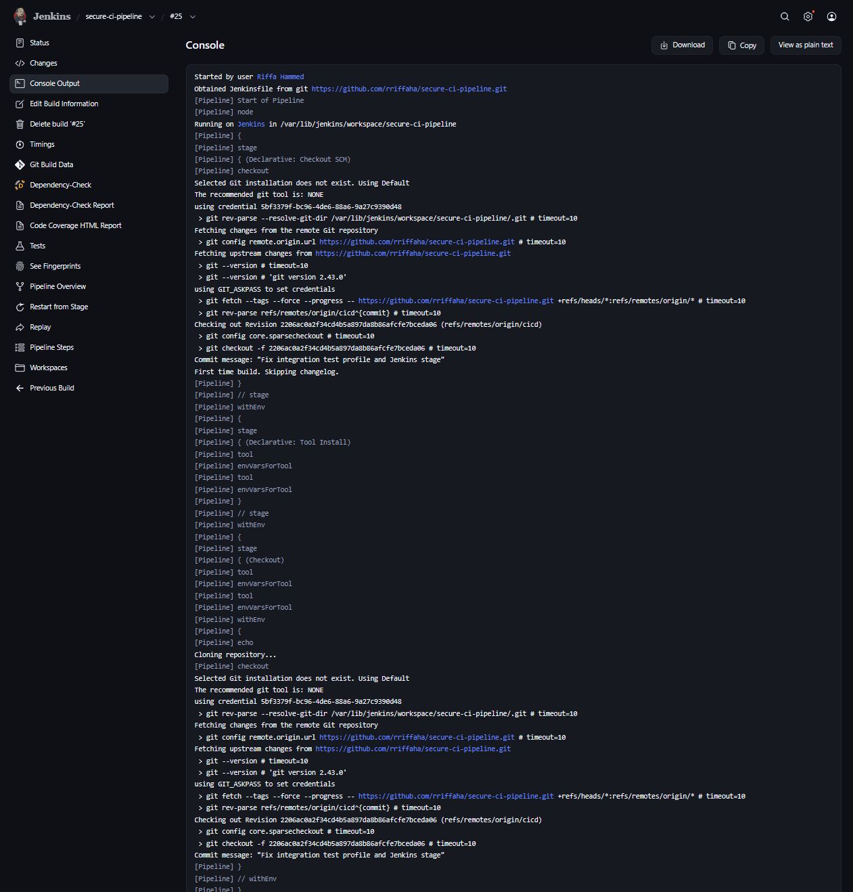

----

## Stage B — Build

The application is built using Maven.

### Command used:
```
mvn clean compile
```

This compiles the Java source code and prepares the application for further analysis.

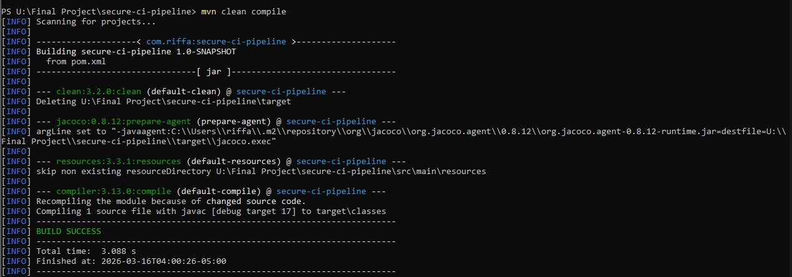

----

## Stage C — Dependency Scanning (Parallel)

Two parallel tasks run to analyze dependencies.

### OWASP Dependency Check

OWASP Dependency Check scans project dependencies for known vulnerabilities using the NVD database.

### Command used:
```
mvn org.owasp:dependency-check-maven:check
```
### Configuration highlights:

* failBuildOnCVSS=9

* Generates XML and HTML reports

* Uses local vulnerability database cache

Reports generated:

```
target/dependency-check-report.xml
target/dependency-check-report.html
```

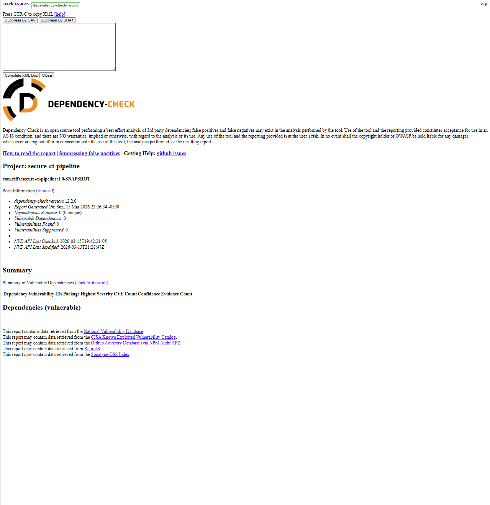

## Maven Dependency Updates

The pipeline checks whether newer versions of dependencies exist.

### Command used:
```
mvn versions:display-dependency-updates
```
This step helps developers identify outdated dependencies.

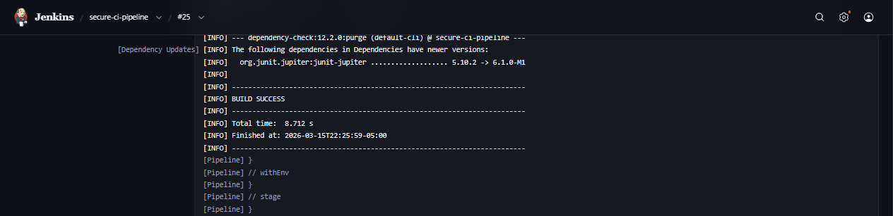

----

## Stage D — Publish Dependency Check Results

The dependency reports generated earlier are published in Jenkins.

### Two reports are published:

* Dependency Check XML report
* Dependency Check HTML report

These reports appear in the Jenkins job sidebar.

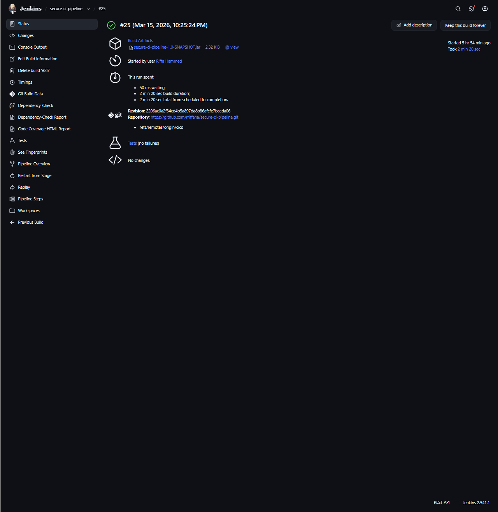

----

## Stage E — Unit Tests

Unit tests validate the correctness of individual components of the application.

Command used:
```
mvn test
```
JUnit reports are published in Jenkins using the JUnit Plugin.

**Result:**
```
Tests run: 1
Failures: 0
Errors: 0
```

The test passed successfully.

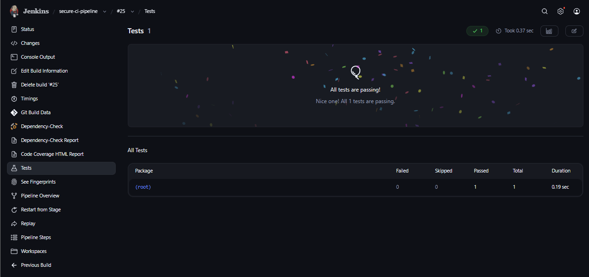

----

## Stage F — Integration Tests

Integration tests validate how multiple components interact.

Command used:
```
mvn verify -Pintegration-tests
```
Integration tests were separated from unit tests using a Maven profile.

The pipeline uses catchError to allow the pipeline to continue even if integration tests fail.

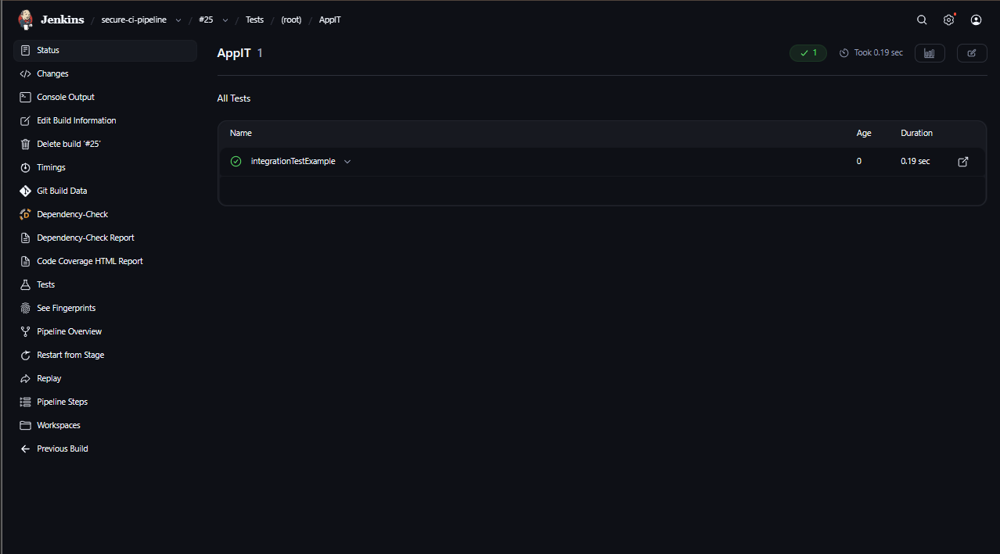

----

## Stage G — Code Coverage

Code coverage is generated using JaCoCo.

### Command used:
```
mvn jacoco:report
```
### Coverage report generated at:
```
target/site/jacoco/index.html
```
This report shows how much of the code is covered by tests.

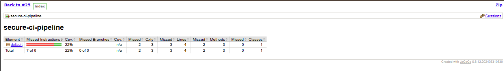

----

## Stage H — SAST (SonarQube)

SonarQube performs static code analysis.

It analyzes:

* Bugs

* Security vulnerabilities

* Code smells

* Code duplication


The following screenshot shows the SonarQube analysis triggered by the Jenkins pipeline, including the project version and execution timestamp.

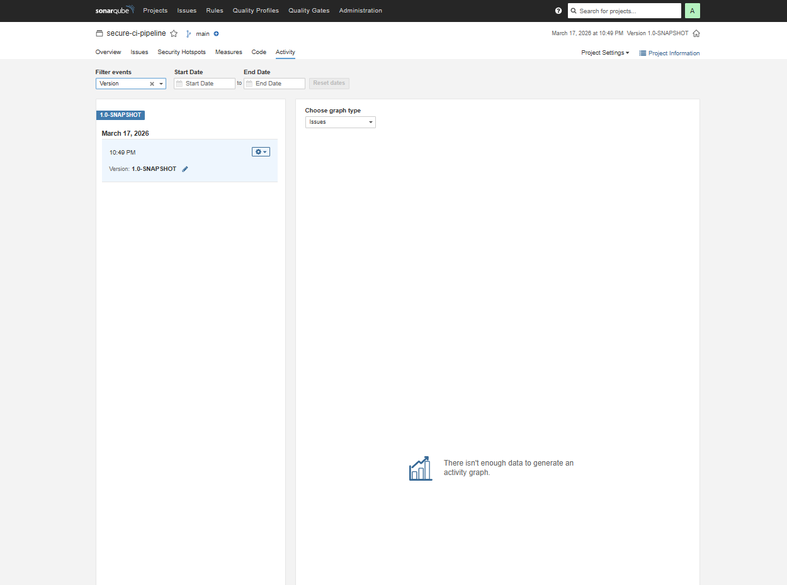

SonarQube dashboard shows project quality status.

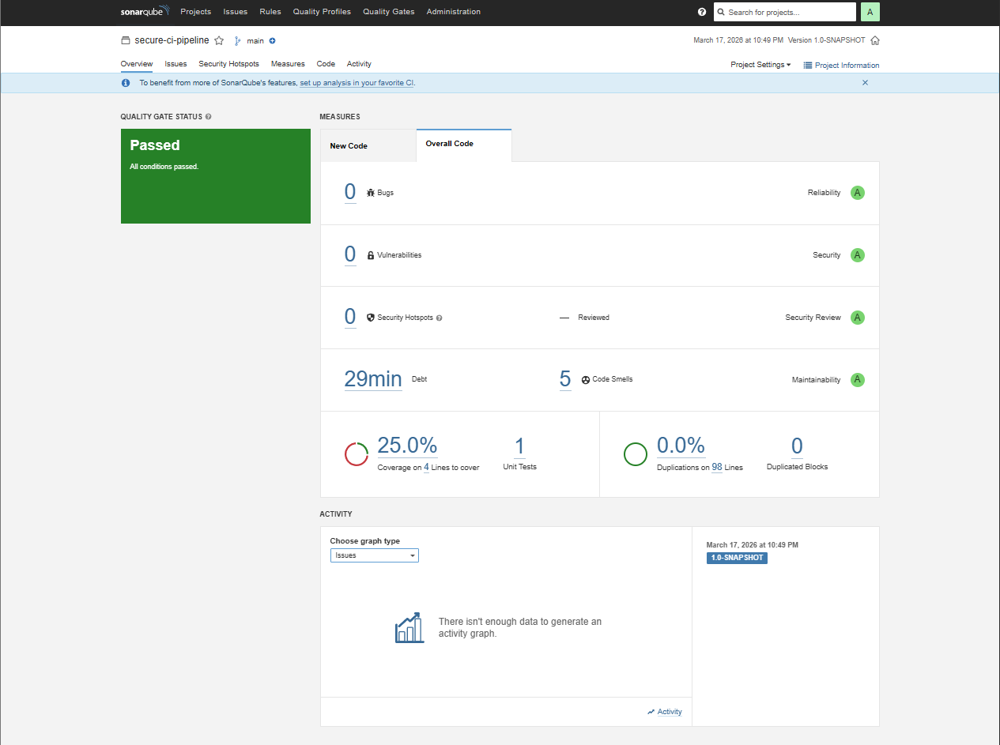

----

## Stage I – Package & Archive Artifact
The application is packaged into a deployable artifact.

### Command used:
```
mvn package -DskipTests
```
### Generated artifact:
```
target/secure-ci-pipeline-1.0-SNAPSHOT.jar
```
The artifact is archived by Jenkins for download.

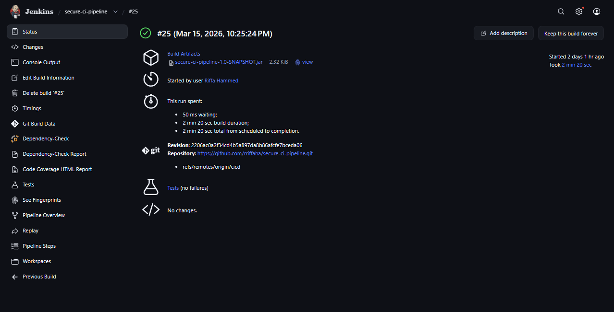

----

## Security Scan — Trivy

Trivy performs filesystem security scanning.

Command used:
```
docker run --rm -v ${PWD}:/project aquasec/trivy fs /project
```
The scan checks for:

* vulnerabilities

* secrets

* misconfigurations

### Result:

0 vulnerabilities found

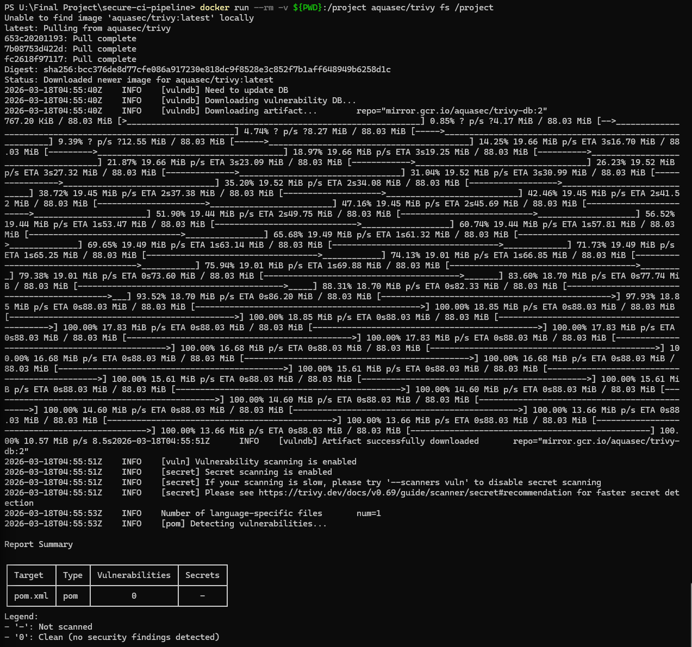

----

## CI Branch Workflow

The project follows a CI/CD branch workflow.

* main → stable branch  
* cicd → CI pipeline development

The cicd branch was set as the default branch.

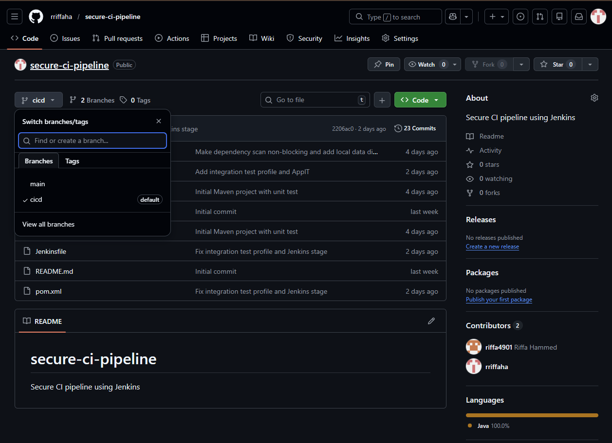

----

## Concept Questions
**When should parallel execution be used in Jenkins?**

Parallel execution should be used when independent tasks can run simultaneously, such as security scans or dependency checks. This reduces overall pipeline execution time.

If one parallel stage fails, Jenkins marks that branch as failed while other branches may continue depending on pipeline configuration.

**2. Why do we stash and unstash dependency reports?**

Each Jenkins stage may run in a different workspace or agent. Files created in one stage may not be available in another stage. stash saves files temporarily and unstash restores them in later stages.

**3. What does catchError(buildResult:'SUCCESS', stageResult:'UNSTABLE') accomplish?**

It allows Jenkins to mark a stage as UNSTABLE instead of failing the entire pipeline. This ensures that later stages such as packaging or reporting still run.

**4. Why is jacoco.xml useful for SonarQube?**

The JaCoCo XML file contains test coverage information. SonarQube reads this file to display coverage metrics in the SonarQube dashboard.

**5. What is the difference between archiving artifacts and leaving them in the workspace?**

Workspace files may be deleted after a build. Archived artifacts are stored by Jenkins and remain available for download from the build history.

**6. If the build fails, what is the first place to check?**

The first place to check is the Jenkins Console Output, which contains detailed logs of each pipeline step and helps identify the cause of the failure.

----
## Challenges Encountered

Several issues were encountered during the implementation:

### 1. OWASP Dependency Check Database Issues

The pipeline initially failed when downloading vulnerability data from the NVD database. This was resolved by configuring the NVD API key in Jenkins credentials.

---
### 2. Jenkins Branch Configuration

The pipeline initially ran from the main branch. The job configuration was updated to build from the cicd branch using:
```
*/cicd
```
### 3. Dependency Check Performance

Dependency scanning was slow due to large vulnerability databases. A local data directory cache was configured to improve performance.

----
## Deliverables

**The repository contains:**

* Jenkins pipeline implementation

* Security scanning integration

* Test reports

* Code coverage reports

* Packaged application artifact

* CI/CD documentation

* Screenshots demonstrating pipeline execution

----
## Docker Containerization

The application was containerized using Docker to enable consistent deployment across environments.

### Docker Build

A Docker image was created using the following command:

```
docker build -t secure-ci-pipeline .
```

### Docker Push

The image was pushed to DockerHub:
```
docker push <your-dockerhub-username>/secure-ci-pipeline
```

This allows the application to be deployed on remote infrastructure such as AWS EC2.

### Purpose

Docker ensures:
- consistent runtime environment
- portability across systems
- simplified deployment process

----
## Infrastructure Provisioning (Terraform)

Terraform was used to provision cloud infrastructure on AWS.

### Resources Created

- EC2 instance (`t3.micro`)
- Security group with:
  - SSH access (port 22)
  - Application access (port 8080)

### Commands Used
```
terraform init
terraform plan
terraform apply
```
### Result

Terraform successfully created the infrastructure and returned:

- Public IP: `13.59.213.22`
- Public DNS: `ec2-13-59-213-22.us-east-2.compute.amazonaws.com`

This demonstrates Infrastructure as Code (IaC) and automated cloud provisioning.

----
## Deployment Verification Attempt

After provisioning the EC2 instance, a deployment verification attempt was performed.

### Test Command
```
curl http://13.59.213.22:8080
```
### Result

The request did not return a response, indicating that the application was not reachable on port 8080.

### Analysis

This suggests that while infrastructure provisioning succeeded, the application container likely did not remain active after startup on the EC2 instance.

### Conclusion

- Infrastructure provisioning using Terraform was successful
- Deployment pipeline reached the cloud environment
- Application runtime issue prevented successful endpoint response

This still demonstrates a complete CI/CD pipeline flow including infrastructure provisioning and deployment attempt.

----
## Screenshots Folder Structure
```
Screenshots
│
01_checkout_console.png
02_build_success.png
03_dependency_check_report.png
04_dependency_updates.png
05_dependency_html_report.png
06_test_results.png
07_integration_tests.png
08_jacoco_report.png
09_sonarqube_dashboard.png
10_archived_artifact.png
11_trivy_scan.png
12_cicd_default_branch.png
```
----

## Conclusion

This project demonstrates the design and implementation of a secure Jenkins CI pipeline integrating security scanning, automated testing, dependency analysis, and artifact packaging.

The pipeline ensures that security, quality, and testing checks are performed automatically during development, enabling secure and reliable software delivery.